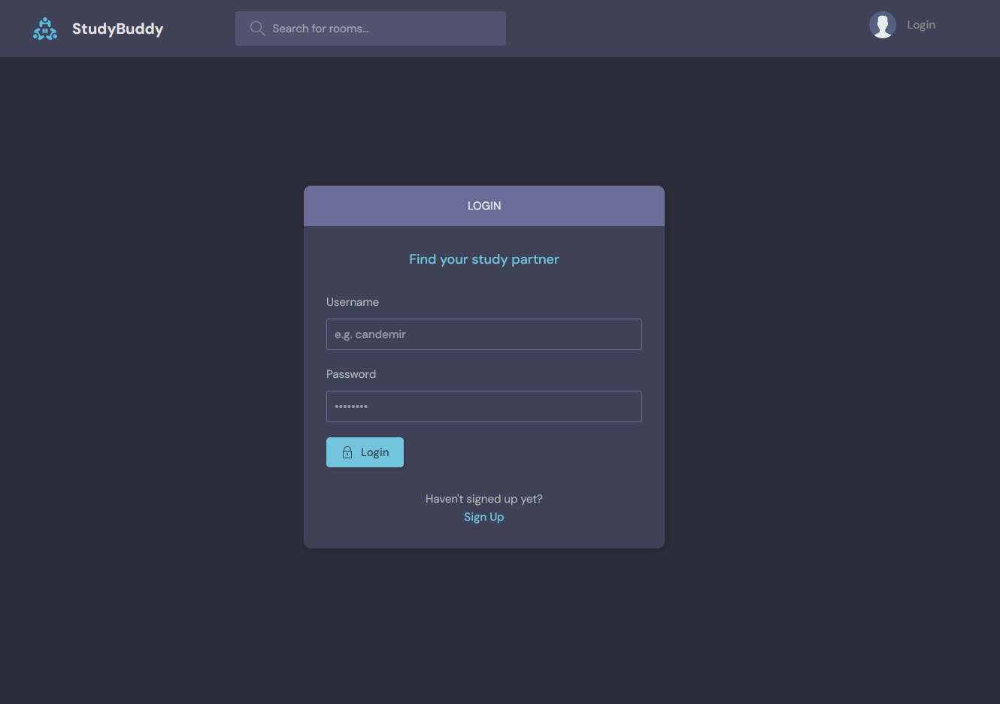
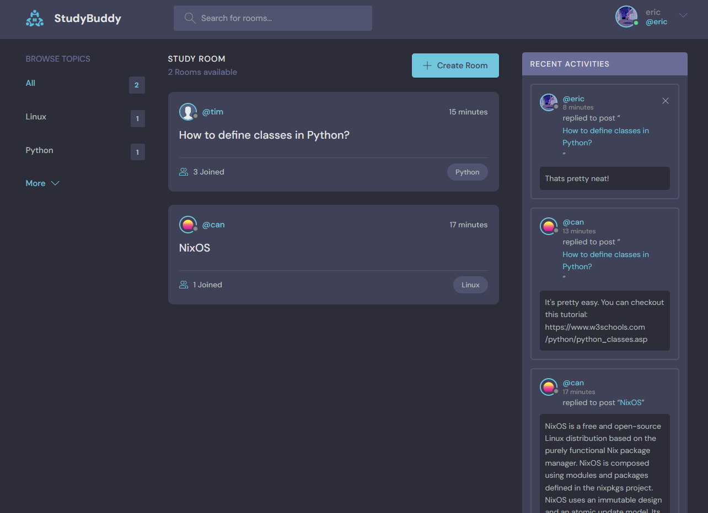
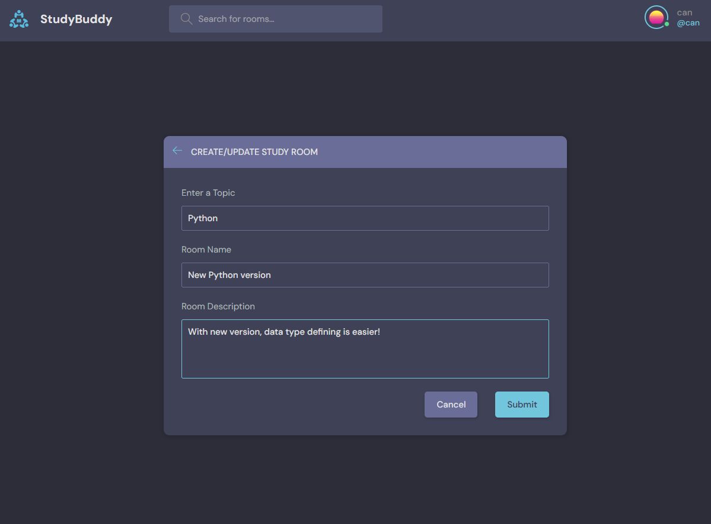
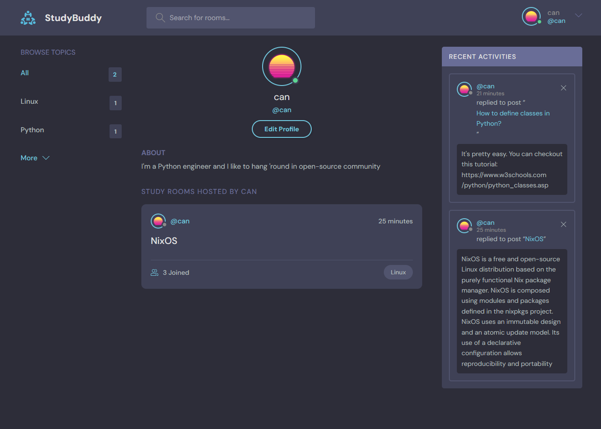

# StudyBud

StudyBud is a website where you can create chat rooms about your favorite topic, browse other topics and talk with other people about it!


### Login or Sign Up:



### Main page:



### Create rooms:



### Participate:


### Customize your profile:



### Get the code, install requirements, run the server
```shell
$ git clone https://github.com/mcandemir/studybud.git
$ cd studybud
$ pip install -r requirements.txt
$ python manage.py runserver
```


### Pull and Run the image directly:
```shell
$ docker pull mcandemir/studybud
$ docker run -p 8000:8000 mcandemir/studybud
# go to: http://localhost:8000/
```


### Build and Run with Docker:
```shell
$ docker build -t studybud
$ docker run -p 8000:8000 studybud
# go to: http://localhost:8000/
```


### Default Profiles in Database:
    username mail: can@email.com
    password: Django1230

    username mail: tim@email.com
    password: Django1230

    username mail: eric@email.com
    password: Django1230


### TODO:
- [x] Dockerize the project and publish on Dockerhub.
- [] Replace SQL database with MongoDB


### Original Django Tutorial Project:
https://www.youtube.com/watch?v=PtQiiknWUcI

https://github.com/divanov11/StudyBud/